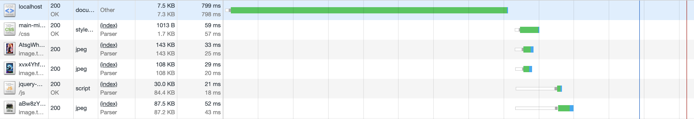
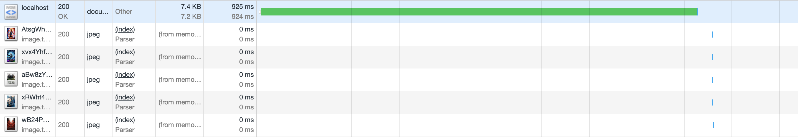

# Performance Matters @cmda-minor-web · 2018-2019

Ik heb er voor gekozen om niet met mijn OBA opdracht verder te gaan omdat ik persoonlijk de OBA API heel frustrerend vind. Ik heb daarom gekozen voor de API van Themoviedb. Ik laat de films zien die afgelopen week zijn uitgekomen en je kunt ook de detailpagina laten zien.


# First view
#### CSS Minify
Om de first view sneller te maken heb ik mijn CSS geminified. Hierdoor wordt het bestand kleiner gemaakt waardoor de gebruiker sneller de styling van de website te zien krijgt.   
<details>
  <summary>Normal</summary>
Ik als eerst gekeken of er een mogelijk is dat de css kleiner gemaakt kunnen worden waardoor deze sneller laadt. Hieronder staat een screenshot van mijn requests van de `main.css`. Hier zie je dat de grootte van dit bestand `2.5KB` is.

  <details>
     <summary>Screenshot</summary>
    
  </details>
</details>
<details>
  <summary>Minify</summary>
  Ik heb met behulp van gulp een bestand gemaakt waar ik de functie gebruik om de css te verkleinen. Het `gulp-css` heeft het bestand van CSS verkleind naar `2.0KB`. Deze CSS wordt omgezet naar een bestand met de naam `main-min.css`  zodat ik in de normale `main.css` de leesbare code heb en deze dus heel makkelijke kan bewerken.
  <details>
   <summary>Code</summary>
  ```js
  gulp.task('css-min', () => {
    return gulp.src(baseDir + '/css/main.css')
      .pipe(cleanCSS({compatibility: 'ie8'}))
      .pipe(rename(function (path) {
        path.basename += "-min";
        path.extname = ".css";
      }))
      .pipe(gulp.dest('public/css/'));
  });
  ```
  </details>
  <details>
     <summary>Screenshot</summary>
    
  </details>
</details>


#### JS Minify
Om de first view sneller te maken heb ik mijn CSS geminified. Hierdoor wordt het bestand kleiner gemaakt waardoor de gebruiker sneller het gedrag van de website te zien krijgt.   
<details>
  <summary>Normal</summary>
  Ik als eerst gekeken of er een mogelijk is dat de css kleiner gemaakt kunnen worden waardoor deze sneller laadt. Hieronder staat een screenshot van mijn requests van de `jquery.js`. Hier zie je dat de grootte van dit bestand `266KB` is.
  
</details>
<details>
  <summary>Minify</summary>
  Ik heb met `gulp-uglify` het bestand van JS verkleind naar `84.7KB`. Deze JS wordt geminified naar een bestand met de naam `jquery-min.js` om het verschil te laten zien.
  <details>
   <summary>Code</summary>
  ```js
  gulp.task('jquery-min', function() {
    return gulp.src(baseDir + '/js/jquery.js')

      .pipe(uglify())

      .pipe(rename(function (path) {
        path.basename += "-min";
        path.extname = ".js";
      }))
      .pipe(gulp.dest('public/js/'));
  });
  ```
  </details>
  <details>
   <summary>Screenshot</summary>

  </details>
</details>

# Repeat View
#### Cache
Om vertraging tegen te gaan moeten er dingen in je cache opgeslagen worden. Dit gebeurd op het moment dat je een website voor het eerst opent. Hierna haalt de browser bepaalde informatie uit de cache. Dit moet je alleen aangeven in de `Cache-Control` van je `Header`. Je moet hier de property `max-age` aanpassen naar de aanbevolen tijd hoelang de browser de data moet onthouden. Ik heb met onderstaande code de `max-age` veranderd naar een jaar.
<details>
  <summary>Code</summary>
  ```js
  app.use((req, res, next) => {
    res.setHeader('Cache-Control', 'max-age=' + 365 * 24 * 60 * 60);
    next();
  });
  ```
</details>
<details>
  <summary>Old</summary>
  
</details>
<details>
  <summary>New</summary>
  
</details>

#### Compression
Na het verkleinen van CSS en JS heb ik de `npm` package `compression` gebruikt om mijn css en JS nog kleiner te maken. Het CSS bestand is kleiner gemaakt tot `1014B`. Dit is een minification van `1.5KB`. Dit staat gelijk aan een verkleining van ongeveer `60%`.
  <details>
    <summary>Old</summary>
    
  </details>
</br>
Het JS bestand is van `266KB` naar `30KB` gegaan. Dit is `236KB` minder dan het origineel. Dit betekend dat het ongeveer `89%` verkleind is.
</br>

  <details>
    <summary>New</summary>
    
  </details>

# Waarom?
Waarom ik de First view en Repeat view belangrijk vond is omdat ik vind dat mensen met een zo hoog mogelijke snelheid de pagina moeten kunnen laden.

# Audit


#### Wat heb ik gedaan
- [x] CSS minify
- [x] JS minify
- [ ] HTML minify
- [x] Cache
- [x] Compression
